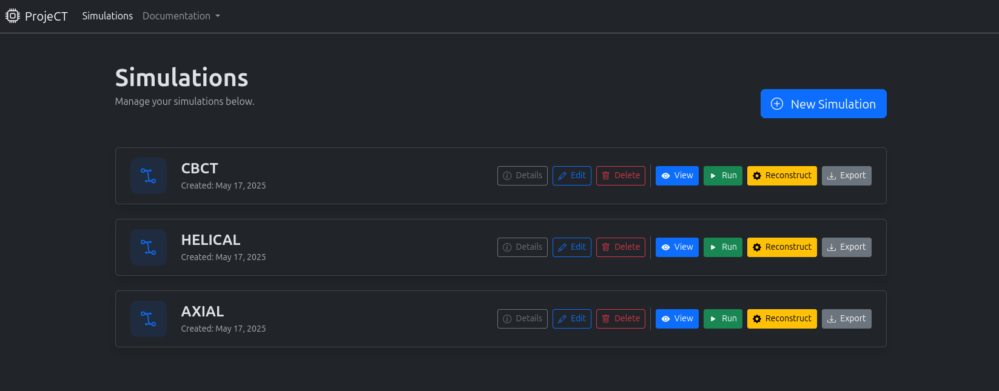
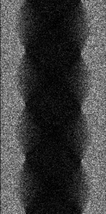
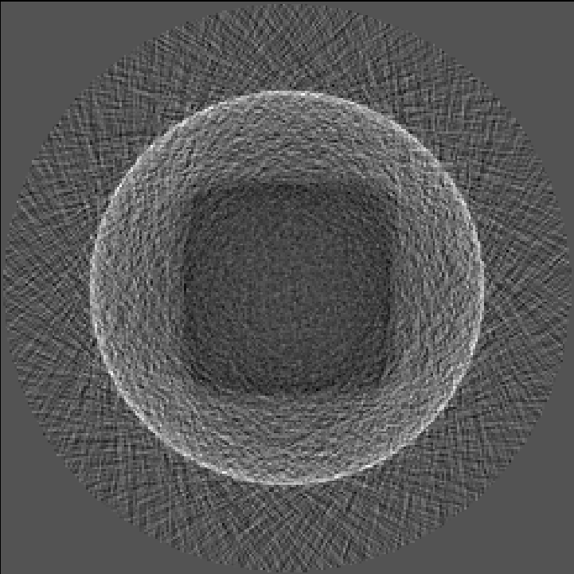

<h1 align="center">
  cbct-lab
</h1>

  
  
  
  

    

ProjeCT is an open-source, browser-based full-stack application that serves as a simulation platform supporting the complete imaging workflow of cone-beam computed tomography (CBCT). It uses [FastAPI](https://fastapi.tiangolo.com/) for the backend to interface with [GATE 10](https://github.com/OpenGATE/opengate) and [LEAP](https://github.com/LLNL/LEAP), while utilizing [Angular](https://angular.dev/) for a user-friendly frontend.

## Features

### Keep track of your GATE simulations

### View your GATE simulation before running it

### Generate projections and reconstruct them

|                              Sinogram of a cube from a CBCT                               |                              Reconstructed middle slice of a cube from a CBCT                               |
| :---------------------------------------------------------------------------------------: | :---------------------------------------------------------------------------------------------------------: |
|  |  |

## Setup

For setup check out the [GitHub Wiki](https://github.com/optui/ProjeCT/wiki)
